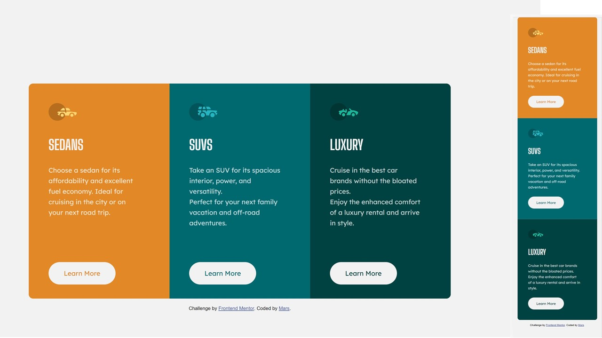

# Frontend Mentor - 3-column preview card component solution

This is a solution to the [3-column preview card component challenge on Frontend Mentor](https://www.frontendmentor.io/challenges/3column-preview-card-component-pH92eAR2-). Frontend Mentor challenges help you improve your coding skills by building realistic projects.

## Table of contents

- [Overview](#overview)
  - [The challenge](#the-challenge)
  - [Screenshot](#screenshot)
  - [Links](#links)
- [My process](#my-process)
  - [Built with](#built-with)
  - [What I learned](#what-i-learned)
  - [Author](#author)

## Overview

### The challenge

The challenge is to build out this 3-column preview card component and get it looking as close to the design as possible.
Users should be able to:

- View the optimal layout depending on their device's screen size
- See hover states for interactive elements

### Screenshot



### Links

- Solution URL: [https://www.frontendmentor.io/solutions/html-and-css-CqLCc5NLb](https://your-solution-url.com)
- Live Site URL: [https://fe-three-column-preview.herokuapp.com/]

## My process

### Built with

- Semantic HTML5 markup
- CSS custom properties
- Flexbox
- Mobile-first workflow

### What I learned

It was extremely hard to place all the buttons at the bottom and aligned.
Flex within adn justify-content: space-between in the parent container did not work as I could either get the buttons and icons aligned but everything depended on how many lines were in the paragraph boxes.
I finally did it by using

```css
button {
  position: absolute;
  bottom: 2rem;
}
```

Previously declaring it's container position: relative.
Problem was that it took the button out of the document flow (shrinking everything). So what I ended up doing was to place an empty div with a height the size of the button.
Not sure if this is a proper technique but it did the work. If someone nows a better way, please do tell.

## Author

- Frontend Mentor - [@martinianol](https://www.frontendmentor.io/profile/yourusername)
